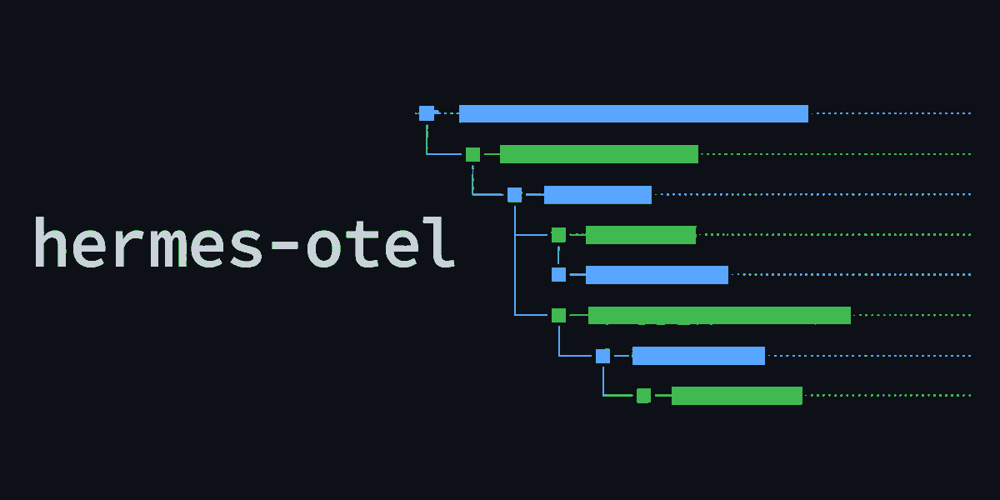

<p align="center">
  <a href="https://briancaffey.github.io/hermes-otel/">
    
  </a>
</p>

<p align="center">
  <a href="https://github.com/briancaffey/hermes-otel/actions/workflows/test.yml"></a>
  <a href="https://github.com/briancaffey/hermes-otel/actions/workflows/deploy-site.yml"></a>
  <a href="https://github.com/briancaffey/hermes-otel/releases"></a>
  <a href="pyproject.toml"></a>
  <a href="https://opentelemetry.io/docs/specs/otlp/"></a>
  <a href="LICENSE"></a>
</p>

<p align="center">
  <b>OpenTelemetry plugin for <a href="https://github.com/nousresearch/hermes-agent">Hermes Agent</a>.</b><br>
  Every Hermes turn — model calls, API requests, tool calls, skill loads, approvals, delegated sub-agents — becomes one OTel trace,
  with token / cost / latency metrics and (optionally) logs, exported to any OTLP/HTTP backend.
</p>

<p align="center">
  <a href="https://briancaffey.github.io/hermes-otel/"><b>Documentation</b></a>
  &nbsp;·&nbsp;
  <a href="https://briancaffey.github.io/hermes-otel/getting-started/quickstart">Quickstart</a>
  &nbsp;·&nbsp;
  <a href="https://briancaffey.github.io/hermes-otel/backends/overview">Backends</a>
  &nbsp;·&nbsp;
  <a href="https://briancaffey.github.io/hermes-otel/configuration/overview">Configuration</a>
  &nbsp;·&nbsp;
  <a href="https://briancaffey.github.io/hermes-otel/reference/span-attributes">Reference</a>
  &nbsp;·&nbsp;
  <a href="CHANGELOG.md">Changelog</a>
</p>

<br>

## What a turn looks like

```text
agent / cron                          ← the turn (root); turn summary at the end
├── skill.{name}                      ← a loaded skill; spans load → turn end
└── llm.{model}                       ← one run_conversation
    ├── api.{model}                   ← one HTTP round-trip; tokens, cost, finish reason
    │   ├── tool.{name}               ← each tool call; args, result, outcome
    │   └── approval.{pattern}        ← human / smart-guardian approval wait
    ├── subagent.{role}               ← delegate_task; the child's own trace nests here
    │   └── agent → llm → api → tool …
    └── api.{model}                   ← final response
```

| Span | Kind | Carries |
|---|---|---|
| `agent` / `cron` | AGENT | Session kind and id, completion / interruption status, the per-turn summary (tools, targets, commands, outcomes, skills, API call count, final status) |
| `skill.{name}` | CHAIN | A skill that loaded successfully — name, source (`skill_view` / path read), path; open until the turn ends |
| `llm.{model}` | LLM | Model, provider, user message (input), assistant response (output) |
| `api.{model}` | LLM | Token counts in both conventions (incl. cache and reasoning buckets), duration, finish reason, request parameters. On failure: `ERROR` + exception + retry metadata |
| `tool.{name}` | TOOL | Args, result, `hermes.tool.outcome` (`completed` / `error` / `timeout` / `blocked` / `cancelled`), inferred target / command, CPU/GPU utilization with host metrics |
| `approval.{pattern}` | CHAIN | Decision wait time, choice (`once` / `session` / `always` / `deny` / `timeout` / `smart_approve` / `smart_deny`), who decided |
| `subagent.{role}` | AGENT | Role, goal, status, duration, summary; the child run is nested so a multi-agent run is one connected trace |

Attributes are emitted in **both** conventions — OpenInference (`llm.*`, `input.value`) for Phoenix and OTel GenAI (`gen_ai.*`) for Langfuse, Weave and generic dashboards — so no backend needs custom mapping. Full lists: [span attributes](https://briancaffey.github.io/hermes-otel/reference/span-attributes) · [metrics](https://briancaffey.github.io/hermes-otel/reference/metrics) · [hooks](https://briancaffey.github.io/hermes-otel/reference/hooks).

## Backends

Tested with: [Phoenix](https://briancaffey.github.io/hermes-otel/backends/phoenix) · [Langfuse](https://briancaffey.github.io/hermes-otel/backends/langfuse) · [LangSmith](https://briancaffey.github.io/hermes-otel/backends/langsmith) · [SigNoz](https://briancaffey.github.io/hermes-otel/backends/signoz) · [Jaeger](https://briancaffey.github.io/hermes-otel/backends/jaeger) · [Grafana Tempo](https://briancaffey.github.io/hermes-otel/backends/tempo) · [Grafana LGTM](https://briancaffey.github.io/hermes-otel/backends/lgtm) · [Uptrace](https://briancaffey.github.io/hermes-otel/backends/uptrace) · [OpenObserve](https://briancaffey.github.io/hermes-otel/backends/openobserve) · [Parseable](https://briancaffey.github.io/hermes-otel/backends/parseable) · [Honeycomb](https://briancaffey.github.io/hermes-otel/backends/honeycomb) · [W&B Weave](https://briancaffey.github.io/hermes-otel/backends/weave).

Any OTLP/HTTP endpoint works as `type: otlp`. Several can be fed at once, each with its own export queue. Which backend carries which signal (Phoenix, Jaeger, Tempo, Langfuse and Weave are traces-only) and the ready-made Compose stacks under [`docker-compose/`](docker-compose/) are in the [backends overview](https://briancaffey.github.io/hermes-otel/backends/overview).

## Install

```bash
hermes plugins install hermes-otel        # from the Hermes plugin catalog
hermes plugins enable hermes_otel         # the manifest name; installing does not enable
```

Hermes 0.21+ installs the plugin's Python dependencies (the three `opentelemetry-*` packages) into its own virtualenv automatically and re-applies them after every `hermes update`. Restart the gateway afterwards if one is running. `hermes plugins update hermes-otel` moves a catalog install to the newest reviewed commit.

**What leaves your machine.** Span data goes only to the OTLP backends you configure. By default (`content_capture: full`) that includes the complete prompt and response of every model call, unclipped, plus previews of tool arguments and output clipped to 1200 characters. With none configured the plugin keeps a local SQLite store under `$HERMES_HOME` for the dashboard and sends nothing. `content_capture: preview` keeps only the clipped previews and `content_capture: off` drops content entirely while keeping the structure; see [Conversation capture](https://briancaffey.github.io/hermes-otel/configuration/conversation-capture) and [Privacy mode](https://briancaffey.github.io/hermes-otel/configuration/privacy). The dashboard's **Settings** tab shows every setting in force, where each came from (file, environment variable or default) and the config file itself.

:construction: Until the [catalog listing](https://github.com/briancaffey/hermes-otel/issues/134) is merged, install from this repository instead (same plugin, not yet catalog-reviewed):

```bash
hermes plugins install briancaffey/hermes-otel/hermes_otel --enable
```

The trailing `/hermes_otel` is the plugin package inside this repo; Hermes installs just that directory to `~/.hermes/plugins/hermes_otel/`. If you installed with `--no-deps`, set `security.allow_lazy_installs: false`, or run a Hermes older than 0.21, install the dependencies yourself: `<hermes venv>/bin/pip install -r ~/.hermes/plugins/hermes_otel/requirements.txt`. Details, upgrades and troubleshooting: [Installation](https://briancaffey.github.io/hermes-otel/getting-started/installation).

## Configure

One backend needs nothing but an environment variable, e.g. `OTEL_PHOENIX_ENDPOINT=http://localhost:6006/v1/traces`. For anything more, create `~/.hermes/hermes_otel.yaml`:

```yaml
project_name: hermes-agent
backends:
  - type: phoenix
    endpoint: http://localhost:6006/v1/traces          # traces
  - type: lgtm
    endpoint: http://localhost:4318/v1/traces          # traces + metrics + logs
    metrics: true
  - type: honeycomb
    api_key: ${HONEYCOMB_API_KEY}                      # ${VAR} is expanded at load
capture_logs: true
```

Each Hermes profile has its own install, settings and telemetry; a multiplexed gateway traces every profile it serves under its own name ([profiles](https://briancaffey.github.io/hermes-otel/configuration/profiles)). [`config.yaml.example`](config.yaml.example) in this repository documents every knob; every scalar knob is also a `HERMES_OTEL_*` environment variable. See the [config schema](https://briancaffey.github.io/hermes-otel/reference/config-schema), the [env var reference](https://briancaffey.github.io/hermes-otel/reference/env-vars), and the guides on [privacy](https://briancaffey.github.io/hermes-otel/configuration/privacy), [sampling](https://briancaffey.github.io/hermes-otel/configuration/sampling), [logs](https://briancaffey.github.io/hermes-otel/configuration/logs) and [host & GPU metrics](https://briancaffey.github.io/hermes-otel/configuration/host-metrics).

Not seeing data? `HERMES_OTEL_DEBUG=true` writes a per-span log — see [debug logging](https://briancaffey.github.io/hermes-otel/development/debug-logging).

## Ask the agent

The plugin ships a Hermes skill, `hermes_otel:observability`, with a terminal query tool the agent runs from the chat. Ask "why was my last turn slow?", "what did this session cost?" or "how often was the deployer skill loaded this week?" and it lists turns, draws one as the span tree above, totals tokens and cost per model, tool or session, and reads metrics and logs, from the local live store (no backend needed) or from any configured backend with a dashboard adapter.

```text
$ python3 ~/.hermes/plugins/hermes_otel/skills/observability/scripts/otel.py trace last
trace 856433c66e23d0b8a0ef10d9ba2c1c53 · source live · 2026-09-21 23:53:22 UTC · session 20260921_195321_b18e68 · model openai/gpt-4o-mini

agent                             13.22 s  ▇▇▇▇▇▇▇▇▇▇▇▇▇▇▇▇  turn 1 · 2 tools · 3 api calls · 39,919 tok · completed · cli
├── llm.openai/gpt-4o-mini        13.19 s  ▇▇▇▇▇▇▇▇▇▇▇▇▇▇▇   openrouter
│   ├── api.openai/gpt-4o-mini     2.01 s  ▇▇                10,695 → 20 tok · tool_calls · 1 tool calls
│   ├── tool.skill_view             37 ms    ▇               completed
│   ├── api.openai/gpt-4o-mini     2.67 s    ▇▇▇             13,810 → 254 tok · 10,624 cached · tool_calls · 3 tool calls
│   ├── tool.terminal              3.81 s        ▇▇▇▇        completed · python3 /private/tmp/claude-501/-Users-brian-gi…
│   ├── tool.terminal              869 ms            ▇       completed · python3 /private/tmp/claude-501/-Users-brian-gi…
│   ├── tool.terminal              315 ms             ▇      completed · python3 /private/tmp/claude-501/-Users-brian-gi…
│   └── api.openai/gpt-4o-mini     3.09 s              ▇▇▇   14,832 → 308 tok · 13,952 cached · stop
└── skill.observability           10.97 s    ▇▇▇▇▇▇▇▇▇▇▇▇▇   skill_view · completed
── 10 spans · 13.22 s · 39,919 tokens
```

`status`, `traces`, `trace`, `span`, `sessions`, `stats`, `metrics`, `logs` and read-only `sql`, each with `--json`, `--since` and `--source <backend>`: see [The observability skill](https://briancaffey.github.io/hermes-otel/skill).

## How it works

Hermes fires lifecycle hooks; the plugin maps them onto spans, metrics and logs through one `TracerProvider` fanned out to every configured backend, and never blocks the agent: span end is a non-blocking enqueue, exporters run on their own threads, hooks fail open. The turn summary, tool identity inference, orphan sweep and batch export are described under [Architecture](https://briancaffey.github.io/hermes-otel/architecture/overview); known gaps under [Limitations](https://briancaffey.github.io/hermes-otel/reference/limitations). Linking MCP-server spans into the agent's trace is implemented on the plugin side but waits on Hermes, see [MCP trace propagation](https://briancaffey.github.io/hermes-otel/configuration/mcp-trace-propagation).

## How this relates to Hermes' built-in telemetry

Hermes ships two observability surfaces of its own. hermes-otel is the third, run-level one, and runs alongside both (core's exporter builds private provider objects and never touches the global tracer provider this plugin installs).

| | Hermes gateway monitoring (core) | Bundled Langfuse plugin | hermes-otel |
|---|---|---|---|
| Scope | Gateway and cron health, content-free by design: no prompts, tool calls, tokens or per-run traces | Per-run traces | Per-run traces (session → LLM → API → tool → sub-agent → approval), GenAI/OpenInference attributes, metrics and logs |
| Backends | Any OTLP receiver (`monitoring.export.otlp`) | Langfuse only | 12+ OTLP backends, fanned out in parallel |
| Coexists with hermes-otel | Yes | Yes | |

Docs for the core surfaces: [Gateway Monitoring](https://hermes-agent.nousresearch.com/docs/developer-guide/gateway-monitoring) and the `plugins/observability/langfuse` directory in hermes-agent.

## Repository layout

| Path | Role |
|---|---|
| `hermes_otel/` | The plugin — the only directory Hermes installs (runtime modules, `plugin.yaml`, the bundled skill, the dashboard bundle) |
| `website/` | The Docusaurus docs site |
| `tests/` | Unit and integration tiers run in CI; `e2e/` and `smoke/` need real backends |
| `docker-compose/` | Backend stacks for local development |
| `dashboard-ui/` | TSX sources for the dashboard tab; `npm run build` writes into `hermes_otel/dashboard/dist/` |
| `scripts/` | The Hermes plugin security scanner, the docs generators and the catalog-entry renderer CI runs |
| `docs/` | Assets fetched from outside the repo at a pinned commit: the plugin-catalog banner and its HTML source (`make banner` re-renders it) |
| `marketing/`, `archive/` | Launch video and article; historical design notes |

## Contributing

See [CONTRIBUTING.md](CONTRIBUTING.md) — the exact CI gate to run locally, the hook / span conventions, and how docs count as acceptance criteria. Releases are cut by release-please from conventional commits ([releasing](https://briancaffey.github.io/hermes-otel/development/releasing)).

## License

Apache-2.0 — see [LICENSE](LICENSE).
